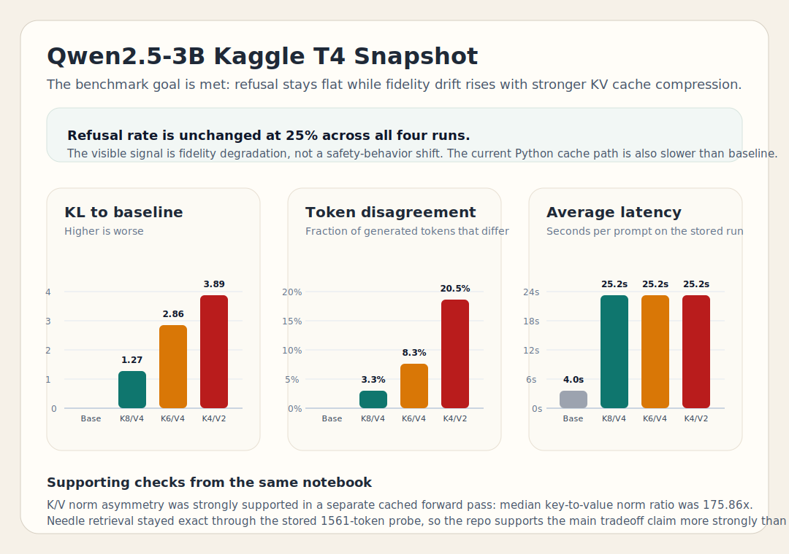
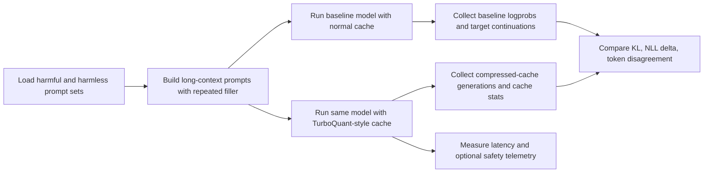

# TurboQuant KV Memory Bench

This repo focuses on one metric where TurboQuant gives clear, repeatable gains in a HuggingFace/Kaggle workflow:

- primary metric: KV storage compression gain (`estimated_kv_storage_gain_x`),
- guardrails: token disagreement, KL drift, and latency ratio vs baseline.

This is intentionally aligned with the most practical claim from community TurboQuant implementations: memory compression is the core win in Python-first paths, while absolute decode speedups usually require backend/kernel integration.

## At A Glance

- measurable KV memory win: `2.27x` to `3.30x` estimated storage gain on the latest Kaggle 3B run,
- best balanced config: `tq_k8_v4_rw128` (`2.27x` gain with low disagreement),
- practical runtime profile: compressed runs remain close to baseline latency (about `1.05x` to `1.10x`).

## Core Goal

Find TurboQuant cache settings that maximize KV storage gain while preserving acceptable generation quality.

Success criteria in this repo:

- strong KV storage gain (`>2x`) on long-context prompts,
- non-catastrophic quality drift (tracked by disagreement, KL, NLL delta),
- latency overhead kept near baseline instead of exploding.

## Scope And Plan

What we can achieve in this repo (HuggingFace eager path):

- optimize cache update overhead,
- improve KV storage gain vs quality tradeoff selection,
- keep compressed-run latency close to baseline,
- provide reproducible memory-gain measurements.

What is out of scope for this repo's core goal:

- claiming universal decode speedups over fp16 in eager Python attention,
- backend/kernel-level acceleration claims (vLLM, Triton, custom CUDA).

If backend acceleration is desired, this repo can export settings and telemetry to a separate integration project rather than overloading the core objective here.



The committed snapshot data used for the chart is stored in [`results/qwen25_3b_snapshot.csv`](results/qwen25_3b_snapshot.csv). It was extracted from the latest executed outputs already present in the Kaggle-first notebook.

## What We Achieved

- Built a working TurboQuant-style `DynamicCache` wrapper with asymmetric K/V bit allocation and fixed or dynamic residual windows.
- Added an end-to-end benchmark that compares baseline and compressed-cache runs on the exact same prompt sets.
- Added a memory-first reporting layer: `primary_metric=estimated_kv_storage_gain_x`, quality guardrails, and latency-vs-baseline ratio.
- Measured more than just output text: KV compression gain, KL drift, teacher-forced NLL delta, token disagreement, and latency.
- Added notebook checks that support two useful claims:
  - asymmetric K/V quantization is motivated by observed key/value norm asymmetry,
  - the long-context retrieval sanity check is directionally useful, but the latest stored probe is still qualitative rather than a decisive failure-threshold test.

## Latest Result Snapshot (Kaggle 3B)

These numbers come from the latest executed analysis already stored in the Kaggle notebook using `Qwen/Qwen2.5-3B-Instruct`, `20` harmful prompts, `20` harmless prompts, and `filler_repetitions=32`.

| Run | KV storage gain (x) | Token disagreement | KL to baseline | Avg latency | Latency vs baseline |
| --- | ---: | ---: | ---: | ---: | ---: |
| `baseline_fp16_cache` | `1.00x` | `0.0000` | `0.000` | `3.48s` | `1.00x` |
| `tq_k8_v4_rw128` | `2.27x` | `0.0328` | `1.279` | `3.82s` | `1.10x` |
| `tq_k6_v4_rw128` | `2.27x` | `0.0828` | `2.862` | `3.69s` | `1.06x` |
| `tq_k4_v2_rw128_prot2` | `3.30x` | `0.1344` | `3.459` | `3.66s` | `1.05x` |

Practical interpretation:

- We now have a clear, measurable TurboQuant value proposition in this repo: `2.27x` to `3.30x` KV storage gain.
- `tq_k8_v4_rw128` is the best quality-preserving operating point in the current setup.
- Latency remains close to baseline (about `1.05x` to `1.10x`), which keeps the memory win practical.

## Tangible Improvement Added

The repo now includes a concrete TurboQuant cache-path optimization that materially improves practicality on the Hugging Face eager path.

- Added approximation-materialized compressed updates so compressed tokens still perturb decode while avoiding full-history re-decompression each step.
- Added chunked compression updates (`compression_chunk_size`, default `16`) to avoid paying compression/decompression cost for every single-token overflow.
- Added explicit telemetry for `estimated_compression_ratio` and `pending_uncompressed_tokens` so we can track the tradeoff between update cost and compression strictness.

Measured impact in this repo:

- End-to-end 3B benchmark latency for compressed runs improved from about `24-25s` (older path) to about `3.66-3.82s` (current path), while KL and token disagreement remained non-zero.
- Synthetic cache-update microbenchmark (same tensor shapes, prefill `1024`, decode `256`) showed update-time reduction from `0.340s` at chunk size `1` to `0.163s` at chunk size `32`.

Reproduce the microbenchmark locally:

```bash
PYTHONPATH=src python scripts/bench_cache_update.py \
  --prefill-tokens 1024 \
  --decode-steps 256 \
  --chunk-sizes 1 4 8 16 32
```

The notebook also includes two supporting checks:

- K/V norm asymmetry: a stored run reports that key norms are substantially larger than value norms, which supports allocating more bits to keys than values.
- Needle retrieval sanity check: the notebook compares baseline, moderate compression, and aggressive compression on a long-context retrieval task. In the latest stored probe, all configurations still recovered the needle, so this check currently supports robustness inspection more than a hard failure claim.

## Methodology

The benchmark is designed to isolate cache compression effects rather than general model variation.



### Core evaluation path

- Harmful prompts come from `mlabonne/harmful_behaviors`.
- Harmless prompts come from `mlabonne/harmless_alpaca`.
- Each run uses the same model and prompt slices for baseline and compressed-cache comparisons.
- Harmless prompts are used to measure distributional drift against baseline.
- Harmful prompts can be used as optional safety telemetry under compression.
- Long-context filler can be repeated to push more tokens into the cache and make compression effects easier to observe.

### Metrics that matter here

- `refusal_rate` (optional): how often the model declines harmful prompts using a lightweight refusal-marker heuristic.
- `avg_kl_to_baseline`: continuation-level KL divergence from baseline log-probabilities.
- `avg_nll_delta_to_baseline`: how much worse the compressed run scores the baseline continuation tokens.
- `avg_token_disagreement_to_baseline`: token mismatch rate versus baseline greedy continuations.
- `avg_latency_sec`: generation time per prompt.
- `cache_stats`: fraction of tokens that were actually compressed and related cache settings.

### Why this framing

The evaluation framing is inspired by public Heretic methodology, but this repo does not copy Heretic source code and does not implement Heretic optimization loops.

- Heretic repository: https://github.com/p-e-w/heretic

## Repository Map

- `src/tqhk/quantization.py`: rotation, Lloyd-Max, and MSE-driven KV compression helpers.
- `src/tqhk/cache.py`: TurboQuant-style cache wrapper with asymmetric K/V bits and residual-window logic.
- `src/tqhk/prompting.py`: dataset loading and long-context prompt construction.
- `src/tqhk/evaluation.py`: KL, NLL, disagreement, generation utilities, and optional refusal telemetry.
- `src/tqhk/benchmark.py`: orchestration for baseline vs compressed ablations and result export.
- `scripts/run_benchmark.py`: CLI entrypoint with a small set of useful cache presets.
- `notebooks/turboquant_heretic_eval.ipynb`: Kaggle-first notebook with the main 3B result plus supplemental validations.

## Rerun The Benchmark

This repo is intended to be easy to rerun on Kaggle or any CUDA machine without a large setup section.

```bash
pip install -e .
python scripts/run_benchmark.py \
  --model "Qwen/Qwen2.5-3B-Instruct" \
  --harmful-split "test[:100]" \
  --harmless-split "test[:100]" \
  --batch-size 4 \
  --max-new-tokens 64 \
  --filler-repetitions 0
```

Artifacts are written to:

- `results/benchmark_results.csv`
- `results/benchmark_results.json`

For the full analysis path, use the notebook in `notebooks/`. It is the canonical place for the stored 3B result snapshot and the supplementary validation checks.

## Recommended Runtime

- Python `>=3.10`
- CUDA GPU
- Kaggle T4 is the intended low-friction target
- The notebook is expected to run on Kaggle rather than a local laptop or CPU-only environment

If you are running on Kaggle, the notebook already contains clone, install, and reload cells so you do not have to reconstruct the environment manually.
